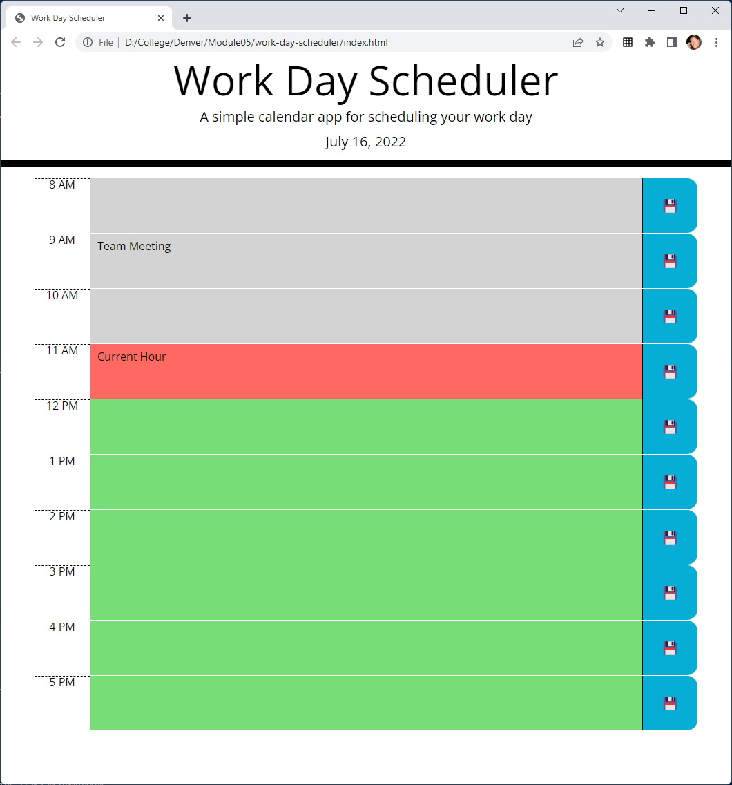
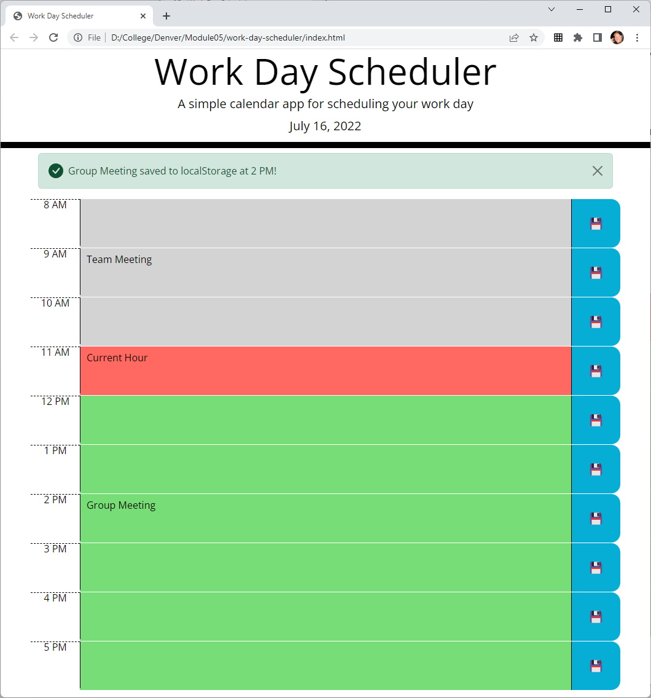

# Work Day Scheduler

This project was built to satisfy the Module 05 Challenge for the University of Denver Coding Bootcamp. The purpose of this challenge is to build a work day scheduler.

## Description

This is a simple calendar application that allows a user to save events for each hour of the day. This app will run in the browser and feature dynamically updated HTML and CSS powered by jQuery.

The [Moment.js](https://momentjs.com/) library is used to work with date and time.

Note: The started code for this challenge referenced Bootstrap v4.3.1 & jQuery v3.4.1. These have been upgraded to Bootstrap v5.2 & jQuery v3.6.0.

### User Story

```
AS AN employee with a busy schedule
I WANT to add important events to a daily planner
SO THAT I can manage my time effectively
```

### Acceptance Criteria

```
GIVEN I am using a daily planner to create a schedule
WHEN I open the planner
THEN the current day is displayed at the top of the calendar
WHEN I scroll down
THEN I am presented with timeblocks for standard business hours
WHEN I view the timeblocks for that day
THEN each timeblock is color coded to indicate whether it is in the past, present, or future
WHEN I click into a timeblock
THEN I can enter an event
WHEN I click the save button for that timeblock
THEN the text for that event is saved in local storage
WHEN I refresh the page
THEN the saved events persist
```

## Getting Started

### Dependencies

The use of a modern web browser.

### URL

- [https://dpk5e7.github.io/work-day-scheduler/](https://dpk5e7.github.io/work-day-scheduler/)

### Screenshots

TODO: Update Screenshots





## Authors

Dan Kelly
Daniel.Kelly@du.edu

## Version History

- 0.1
  - Initial Release

## License

This project is not licensed.

## Acknowledgments

- [Denver Coding Bootcamp](https://bootcamp.du.edu/)
- [W3Schools](https://www.w3schools.com/)
- [Mozilla Developer Network](https://developer.mozilla.org/)
- [Moment.js](https://momentjs.com/)
- [jQuery](https://jquery.com/)
- [Bootstrap](https://getbootstrap.com/)
